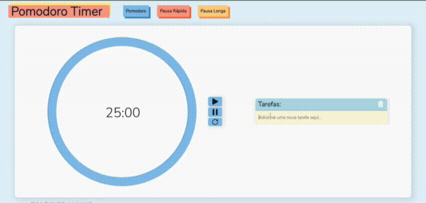

# Pomodoro Timer

Timer de produtividade desenvolvido com React.JS.

### Funcionalidades
- [ ] Listar suas as tarefas a fazer e descartá-las quando tiver terminado-as;
- [ ] Ser notificado pelo browser quando o cronômetro chegar ao fim;
- [ ] Cronômetro para: tarefas, pausas rápidas e pausas longas.

*[Cheque o app aqui](https://beatrizmotta.github.io/PomodoTimer/)*